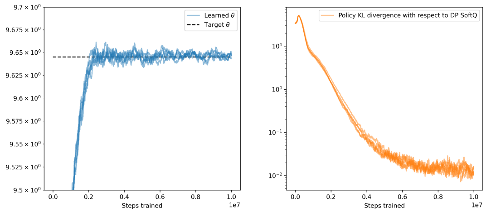

# rl-scripts

## Install dependencies
```
conda create -n ulearn python
conda activate ulearn
conda install -c conda-forge numpy pandas gym matplotlib scipy joblib progress
```

## Running examples

```
# reproduce figure 2
python example_v_values.py
```


```
# reproduce figure 3
python example_shortest_path.py
```

```
# reproduce figure 4
python example_model_free.py
```


```
# reproduce figure S1
python example_irreducible_towards_reducible.py
```

